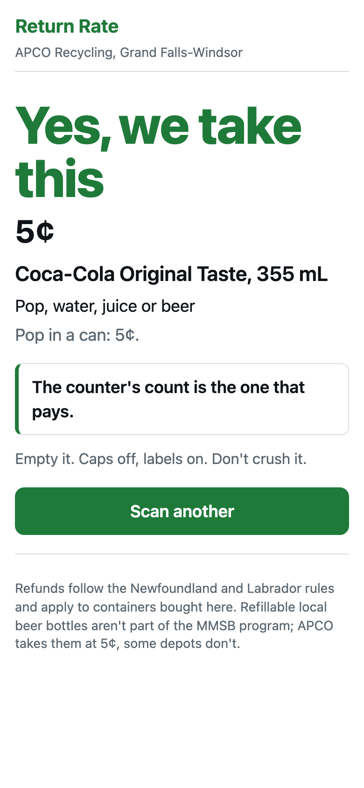

# Return Rate

Point your phone at a container's barcode and find out whether the Green Depot takes it. Just the barcode: no photo, no AI, nothing leaves the phone but the number. The headline is **Yes, we take this / No, we don't take this**; the refund (5¢ or 10¢) is the second line. Anything that isn't a beverage container is a no. One simple app for customers and depot staff alike: no passwords, no set-up, nothing to confirm. Built for customers of APCO Recycling in Grand Falls-Windsor, Newfoundland and Labrador, and only for Newfoundland and Labrador's rules.

Live: https://return-rate-app.alexjpower74.workers.dev



## The rules, and where they come from
`docs/RULES.md` is the authority. It was researched from the Waste Management Regulations 2003 (ss. 12, 14, 18), MMSB's April 2025 Beverage Distributor Guide (the deposit chart, the exclusions, and the appendix that rules product by product), MMSB's FAQs, NLC's returns FAQ, and APCO's own counter practice. Every line is cited, and the source documents are archived in `docs/sources/`.

The short version:
- **10¢** only for wine and spirits (anything alcoholic that isn't beer: coolers, ciders, seltzers, cocktails, sake) in a **glass or plastic bottle over 50 mL**.
- **5¢** for everything else that's refundable: all non-alcoholic drinks up to 5 L, all beer, liquor in cans, pouches, bag-in-box, tetra and cartons, 50 mL miniatures.
- **No refund**: milk labelled Milk, fortified plant milks that are a source of protein, infant formula, "Meal Replacement" and "Formulated Liquid Diet" labels, concentrates, distilled water, over 5 L, refillables, anything bought outside NL.
- **APCO's own policy**, shown as APCO's: local brewers' refillable bottles and Quidi Vidi Iceberg blue bottles, 5¢ here; some depots don't take them.
- A depot may refuse crushed, broken, dirty or unlabelled containers (regulation s.18).

## How it knows
Barcode only, no AI, no per-scan cost (Alexander's order, 2026-09-18: the label photo and the vision model were removed). Three ways, in order: the exact barcode in the list; the maker's barcode prefix (Coca-Cola, PepsiCo, Monster, Red Bull and other drink-only makers: everything they sell is a 5¢ container, so the maker alone answers; mixed makers like Kirkland are deliberately excluded); and a free Open Food Facts lookup. When none of them knows, the app says so and sends the person to the counter. The barcode reader is the browser's own on Android and a pinned zxing-wasm polyfill on iPhone, with a "take a photo of the barcode" fallback for curved cans that is decoded on the phone.

**Since 2026-09-18** there is a step after the maker prefix: an unknown barcode is looked up on **Open Food Facts** (a public, volunteer-built database, free, no key) and classified by the same rules engine. A definite answer is remembered in the list, so the next person gets it instantly; a product OFF knows but the rules cannot settle (a wine with no stated bottle) is remembered by name and the person is told what to read on the label; a product OFF files as food, not drink, gets "No". Coverage on Canadian shelf items is patchy and OFF rate-limits bursts, so a miss is an honest unknown: ask at the counter. Every unknown scan is still logged (`/stats` lists the top unknowns) so the counter can add what real customers bring. The two spellings of one North American barcode (12-digit UPC-A as a phone reads it, 13-digit with a leading 0 as OFF and half the list write it) are looked up together; 481 list rows were only reachable by the second spelling before.

**The barcode reader** asks the phone camera for its full resolution and continuous focus, decodes a centre crop at native pixels (with a full-frame pass every fourth time and a contrast-stretched pass for dark cans), needs the same code twice in a row before it answers, and offers a Light button where the phone has a torch. Bench: `node tools/scan-bench/bench.mjs` (still photos, old reader vs new, exits 1 unless the new one reads more) and `node tools/scan-bench/live.mjs` (Chromium fed a fake camera stream of a barcode must reach the answer screen; a blank stream must not).

## The honesty rule
The label decides the dairy-looking cases (Nesquik "flavoured milk beverage" is refundable; chocolate milk labelled Milk is not), and MMSB publishes no product registry. So a barcode is allowed to auto-answer only where the label cannot change the answer. For milk, plant-based, nutrition, infant, electrolyte and coffee-with-milk products the app says **"Ask at the counter"** and tells the person exactly what words on the label decide it (Milk, fortified soy beverage, not a source of protein, Meal Replacement, Return for Refund). `docs/seed-split.mjs` enforces that gate: of 1,034 products, 963 auto-answer and 71 get the label test. An unknown barcode gets the general test: if the label says Return for Refund and it was bought in NL, the depot takes it.

## Results
| Check | Result |
|---|---|
| Main's oracle: 63 cases written from RULES.md (every row of the MMSB chart, the traps, APCO's policies) against the rules engine | **63 of 63** |
| Rules engine unit tests (chart rows, traps, wording sweep) | **58 assertions** |
| Worker API tests against a local D1: known classes, unknown 404 with the label test, label-dependent 404 with the name and guidance, malformed, rate guard, stats | **74 of 74** |
| App suite, Chromium and WebKit, real typing, verdict is the largest text, cents smaller, money line on every answer, camera refused, offline | **19 of 19** |
| Root QA journey and plain-English sweep with built-in negative controls | **12 of 12** |
| 44 real shelf barcodes (Sobeys, Dominion, NLC) against the deployed Worker | **44 of 44** |
| Photo evals | removed 2026-09-18 with the vision path |
| Live round-trip against the deployed Worker | all green |

The crew's first version of the rules engine passed its own 54 tests and still missed 13 of the 63 oracle rows, because the rules were refined after it was built (tetra wine, canned liquor, refillable bottles, new drink types). The oracle is owned by main, written from the document, and is the check the crew's tests couldn't be.

## Run it yourself
```
cd worker && npx wrangler d1 migrations apply bottle-count --local && node seed.mjs ../data/seed-rows.json ../data/seed.sql
npx wrangler d1 execute bottle-count --local --file=../data/seed.sql && npx wrangler d1 execute bottle-count --local --file=../data/needs-counter.sql
npx wrangler dev --port 5902 && node --test tests/        # in two terminals
node docs/rules-oracle.mjs worker/src/rules.js
node evals/run.mjs --api http://127.0.0.1:5902
npx playwright test                                      # root QA
npx playwright test -c app/tests/playwright.config.js   # c2's suite
```
Contract: `docs/API.md`. Product list: `data/README.md`. How each slice was built and made red: `docs/build-report-c1..c4.md`.

## Not done yet
- Real scanning on a phone at the depot: the barcode reader ran on a fake camera in tests, never on a shelf item.
- The database is shared with Bottle Count (the account's D1 quota is full); its own tables, no overlap.
